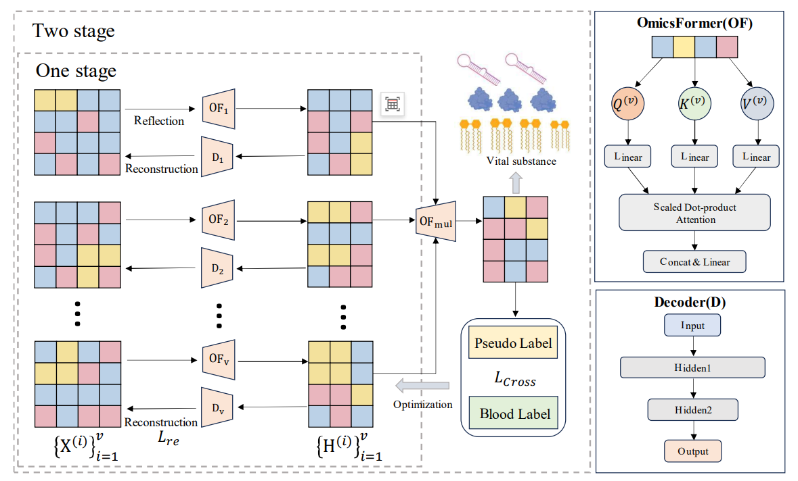

# **Integrative Multi-Omics and Blood Routine Analysis for Risk Prediction**

  
**Figure 1: Overall Project Framework**

---

## **Table of Contents**

- [Project Overview](#project-overview)
- [Dependencies](#dependencies)
- [Code Structure](#code-structure)
- [Usage Instructions](#usage-instructions)
- [File Descriptions](#file-descriptions)
- [Execution Examples](#execution-examples)
- [Results](#results)
- [Contact Information](#contact-information)

---

## **Project Overview**

This project focuses on **early prediction of chronic disease risks** by integrating blood routine data and multi-omics data using deep learning and clustering methods.  

### **Objectives**:
- Perform **clustering analysis** on blood routine data to discover hidden patterns.  
- Use deep learning to analyze multi-omics data and identify critical features.  
- Build a classification model for **disease risk prediction** based on blood routine data.  

---

## **Dependencies**

Ensure the following dependencies are installed:

- **Python 3.9+**
- **PyTorch 2.5+**
- **Numpy 2.0+**
- **Scikit-learn**
- **Matplotlib**

---

## **Code Structure**

```plaintext
project-root/
│-- blood clustering-real.py   # Risk classification using blood routine data
│-- datasets.py                # Data loading and preprocessing
│-- lable_gen.py               # Clustering analysis for blood routine data
│-- load_data.py               # Data loading utilities
│-- main.py                    # Multi-omics feature extraction and training
│-- network.py                 # Deep neural network architecture
│-- Nmetrics.py                # Evaluation metrics
│-- utils.py                   # Utility functions
```

---

## **Usage Instructions**

### **1. Clustering Analysis for Blood Routine Data**

To analyze and cluster blood routine data, run:

```bash
python lable_gen.py
```

---

### **2. Multi-Omics Feature Extraction and Training**

To train the model and identify critical features from multi-omics data:

```bash
python main.py
```

---

### **3. Clinical Risk Classification**

To perform disease risk classification on blood routine data:

```bash
python blood clustering-real.py
```

---

## **File Descriptions**

| File                   | Description                                                                 |
|------------------------|-----------------------------------------------------------------------------|
| **blood clustering-real.py** | Performs disease risk classification on blood routine data.             |
| **lable_gen.py**       | Conducts clustering analysis of blood routine samples.                     |
| **main.py**            | Trains the model and extracts key features from multi-omics data.          |
| **network.py**         | Defines the neural network architecture.                                   |
| **datasets.py**        | Loads and preprocesses blood routine and multi-omics datasets.             |
| **Nmetrics.py**        | Provides evaluation metrics like accuracy, precision, recall, and F1-score. |
| **utils.py**           | Includes helper utilities for visualization, logging, etc.                 |

---

## **Execution Examples**

### **Run Clustering Analysis**

To cluster blood routine data:

```bash
python lable_gen.py
```

---

### **Train Multi-Omics Model**

To analyze multi-omics data and identify key features:

```bash
python main.py
```

---

### **Risk Classification**

To predict disease risks using blood routine data:

```bash
python blood clustering-real.py
```

---

## **Results**

- **Clustering Analysis**: Outputs clustering labels and visualizations for blood routine data.
- **Feature Identification**: Saves extracted key features from multi-omics data.
- **Risk Classification**: Outputs predicted risk levels along with evaluation metrics (accuracy, precision, recall, and F1-score).

Results are saved in structured formats for further analysis.

---

## **Contact Information**

For inquiries, please contact:
**Email**: `dzb20@nudt.edu.cn`

